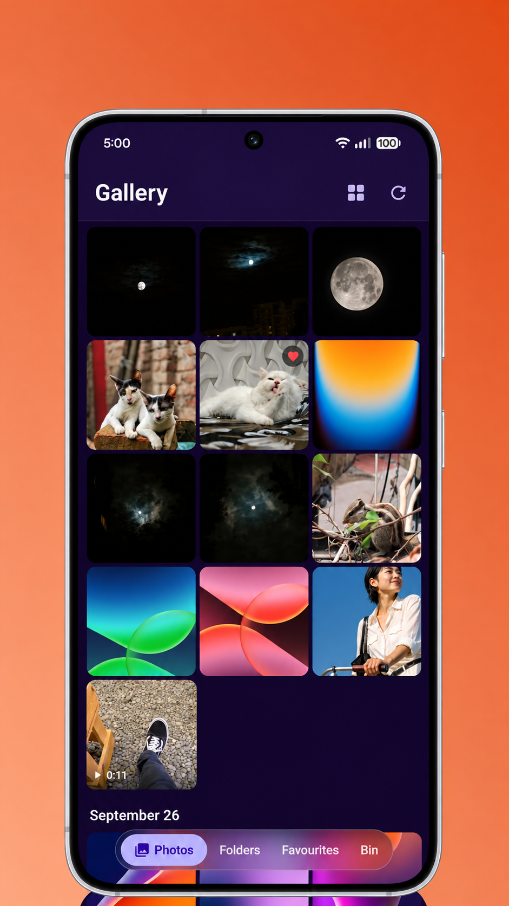
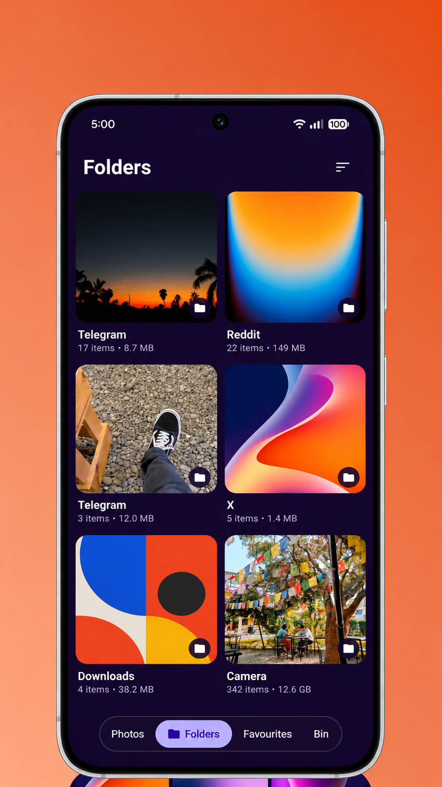
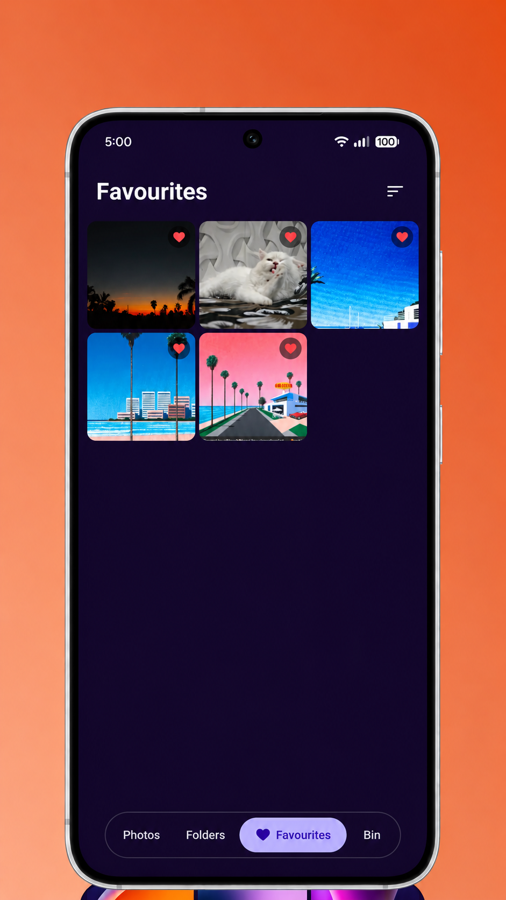
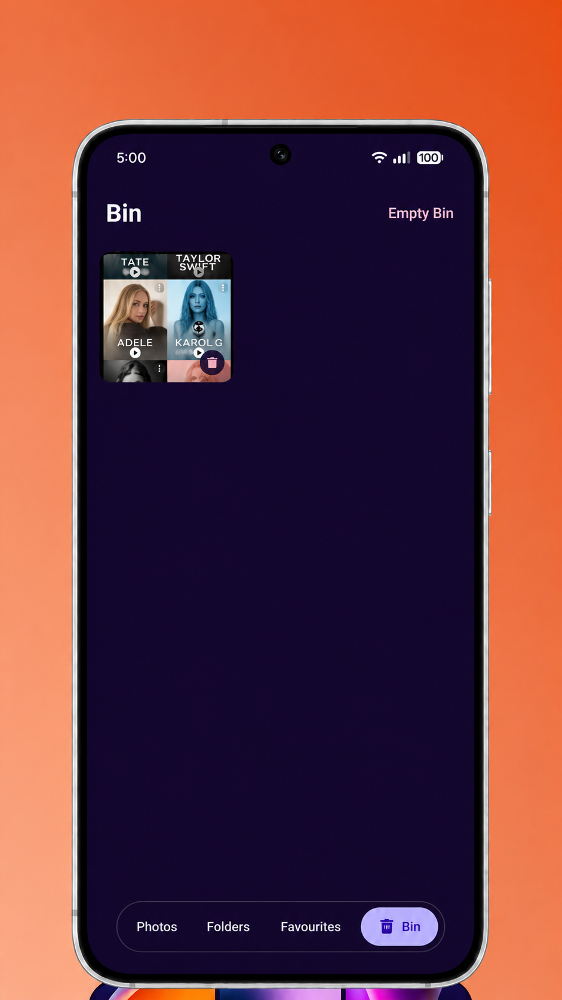

# Pixelia

A small, open-source material you expressive gallery app for Android. Browse your photos and videos, keep them organized, and make quick edits. Built with Jetpack Compose.

## Screenshots

<p align="center">
  
  
  
  
</p>

## Features

- Date-grouped photo and video grid that stays smooth with large libraries
- Folder view with copy, move, and share
- Favorites, plus a Bin so deleted items can be recovered
- Non-destructive editor: crop, rotate, flip, and color filters
- Metadata viewer with EXIF details and a map link for GPS location
- Foldable tabletop mode
- Drag and drop into other apps
- Multi-select for batch actions

## Install

Pixelia isn't on F-Droid yet. For now, APKs are on the [Releases](../../releases) page.

## Privacy

Pixelia needs access to your photos and videos to show them. It has no analytics or tracking.

## Building

You need JDK 17 and Android SDK 36 (minimum SDK 26).

```bash
./gradlew assembleDebug
```

## Contributing

Bugs and ideas are welcome in [issues](../../issues). Pull requests too.

## Credits

Mockups built using (https://www.brandbird.app/)

## License

[GPL-3.0](LICENSE)
